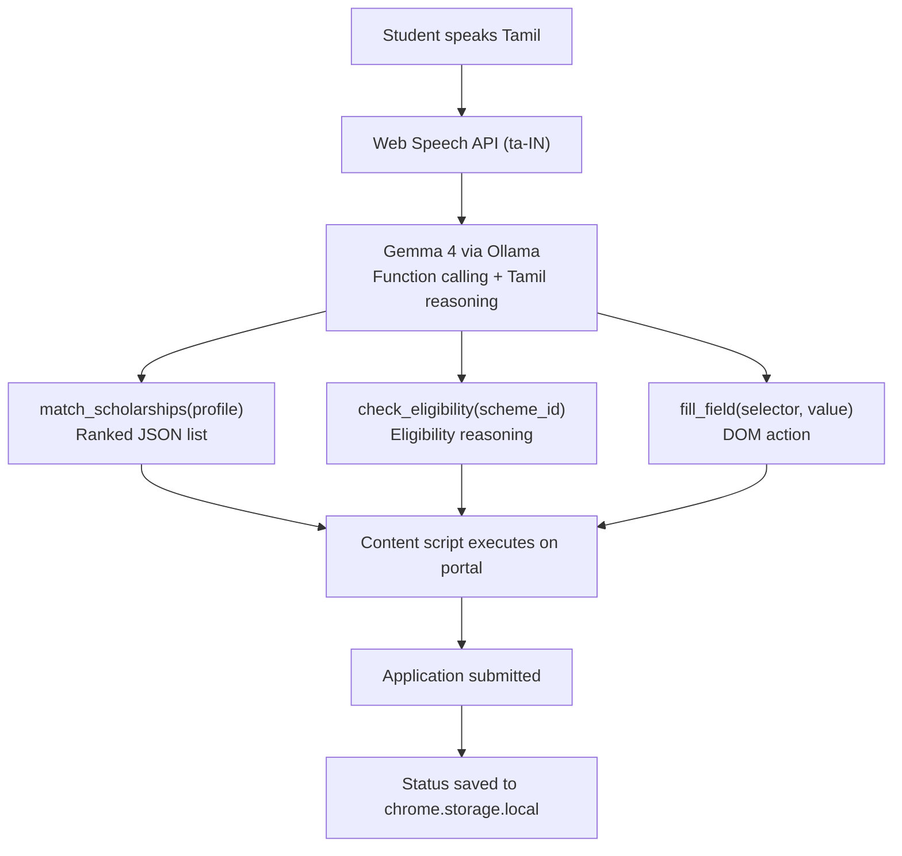

# Athena — Tamil-first Scholarship Agent

> **Built for the Google Gemma 4 Impact Challenge**  
> An offline-first, Tamil-language browser agent that finds and auto-fills government scholarship applications for first-generation students — powered entirely by Gemma 4 running locally via Ollama.

---

## The Problem

**₹3,000 crore in government scholarships go unclaimed every year in India.**

Not because students don't qualify — but because:
- Portals are English-only in a country with 22 official languages
- Eligibility criteria are buried in bureaucratic language
- Rural students have no reliable internet to navigate cloud-based tools
- First-generation students have no one to guide them through the process

In Tamil Nadu alone, schemes like the BC/MBC Scholarship, NSP Post-Matric Award, and Tamil Nadu e-Grantz serve millions — yet application rates remain devastatingly low.

---

## The Solution

Athena is a Chrome extension powered by **Gemma 4 running locally via Ollama**. It:

1. **Finds** scholarships that match a student's profile (caste, income, marks, course, district)
2. **Explains** eligibility in plain Tamil — spoken or typed
3. **Fills** application forms automatically across government portals
4. **Tracks** deadlines and application status in a local dashboard
5. **Works offline** — once seeded, no internet required

Everything runs on the student's own device. No cloud. No subscription. No data shared.

---

## Demo

[](https://youtube.com/YOUR_LINK_HERE)

[](https://huggingface.co/spaces/YOUR_SPACE_HERE)

---

## How Gemma 4 Powers This

| Feature | How Athena uses it |
|---|---|
| **Native function calling** | Gemma 4 outputs structured JSON tool calls (`match_scholarships`, `fill_field`, `check_eligibility`) to drive autonomous multi-step form filling |
| **Multilingual Tamil reasoning** | System prompt instructs Gemma 4 to reason and respond in Tamil — no translation layer needed |
| **Thinking mode** (`<\|think\|>`) | Eligibility decisions show step-by-step reasoning — explainable AI for high-stakes outcomes |
| **Local via Ollama** | All inference runs at `localhost:11434` — zero data leaves the device, works in airplane mode |

---

## Quick Start

### Prerequisites
- Chrome browser (Manifest V3 support)
- [Ollama](https://ollama.com) installed and running
- 8GB RAM minimum

### 1. Install Ollama and pull Gemma 4
```bash
# Install Ollama
curl -fsSL https://ollama.com/install.sh | sh

# Pull the model
ollama pull gemma3:4b

# Allow Chrome extension to connect
launchctl setenv OLLAMA_ORIGINS "*"   # macOS
# or
sudo systemctl edit ollama            # Linux — add Environment="OLLAMA_ORIGINS=*"
```

### 2. Load the extension
```bash
git clone https://github.com/YOUR_USERNAME/athena
cd athena
npm ci
npm run build
```

1. Open Chrome → `chrome://extensions`
2. Enable **Developer Mode** (top right)
3. Click **Load unpacked**
4. Select the `dist/athena/` folder

### 3. Run it
1. Click the Athena icon in your toolbar
2. Fill in your student profile (takes 2 minutes)
3. Open any scholarship portal (try [scholarships.gov.in](https://scholarships.gov.in))
4. Ask Athena: *"என்னுடைய படிப்புக்கு என்ன scholarship கிடைக்கும்?"*

---

## Build & Packaging

Requires Node.js 18+.

```bash
npm ci                # Install dependencies
npm run validate      # Manifest + i18n + reference integrity check
npm run icons         # Generate icons (only needed once)
npm run build         # Build into dist/athena/ for Chrome loading
npm run package       # Package as dist/athena.zip for Chrome Web Store
```

Packaging uses `archiver` (pure-Node), so it works on Windows, macOS, and Linux without an external `zip` CLI.

## Project Structure

```
athena/
├── docs/                       # Long-form docs
│   ├── ARCHITECTURE.md         # System internals
│   ├── DEPLOYMENT.md           # Deployment-readiness plan
│   └── KAGGLE.md               # Competition writeup
├── scripts/                    # Build tooling (Node ESM)
│   ├── build.mjs               # src/ + bundled web-llm → dist/athena/
│   ├── bundle-webllm.mjs       # esbuild bundle of @mlc-ai/web-llm
│   ├── generate-icons.mjs      # Programmatic PNG icons
│   ├── package.mjs             # Zip dist/athena/ → dist/athena.zip
│   └── validate.mjs            # Pre-build integrity checks
├── src/                        # Everything that ships in the extension
│   ├── manifest.json           # Manifest V3
│   ├── background.js           # Service worker (Ollama orchestration)
│   ├── content.js              # Content script (DOM observer + filler bridge)
│   ├── sidepanel.html          # Side panel UI
│   ├── sidepanel.js            # Side panel controller (WebLLM primary, Ollama fallback, HITL approval)
│   ├── agent/
│   │   ├── matcher.js          # Scholarship matching + eligibility scoring
│   │   ├── filler.js           # DOM form-fill executor
│   │   └── tracker.js          # Application status tracker
│   ├── data/
│   │   ├── db.js               # IndexedDB wrapper
│   │   └── schemes.json        # Pre-seeded scholarship database
│   ├── locales/
│   │   ├── en.json
│   │   └── ta.json
│   ├── styles/
│   │   └── sidepanel.css       # Scholar's Ledger design system
│   ├── fonts/                  # Self-hosted Fraunces + Plus Jakarta Sans + Noto Serif Tamil
│   └── icons/                  # 48px + 128px extension icons
├── .github/workflows/          # CI + release pipelines
├── LICENSE
├── PRIVACY.md
├── README.md
└── package.json
```

### Inference paths

Athena runs LLM inference through two paths, in priority order:

1. **WebLLM (primary)** — Gemma 2 2B (q4f16) compiled for WebGPU, runs entirely in the browser process. First-time model download is cached locally. No external dependencies once the model is cached.
2. **Ollama (fallback)** — `gemma3:4b` at `http://localhost:11434`. Used when WebGPU isn't available or WebLLM init fails.

Want to compile a newer Gemma for in-browser use? See `docs/ARCHITECTURE.md` for the MLC-LLM build pipeline.

---

## Supported Scholarship Portals

| Portal | Schemes covered | Auto-fill support |
|---|---|---|
| [scholarships.gov.in](https://scholarships.gov.in) (NSP) | 15+ central schemes | Yes |
| [tnscholarship.net](https://tnscholarship.net) | TN BC/MBC/SC/ST schemes | Yes |
| [Tamil Nadu e-Grantz](https://egrantz.tn.gov.in) | State welfare schemes | Partial |
| [Buddy4Study](https://buddy4study.com) | Private scholarships | Read-only matching |

---

## Architecture Overview



---

## Prize Track Eligibility

- **Digital Equity & Inclusivity** — Tamil language, offline access, first-gen students
- **Ollama Special Prize** — Core runtime, airplane mode demo
- **Future of Education** — Scholarship access as educational enabler
- **Main Track** — Vision + technical depth + real-world impact

---

## Roadmap

- [ ] Mobile app via LiteRT (Gemma 4 E2B on Android)
- [ ] Support for 10 more Indian languages (Hindi, Telugu, Kannada, Malayalam...)
- [ ] DigiLocker integration for automatic document attachment
- [ ] Reminder agent — proactive deadline notifications via local scheduler
- [ ] Offline PDF generation for postal submissions

---

## License

MIT License — free to use, fork, and build on.

---

## Built With

- [Gemma 4](https://ai.google.dev/gemma) by Google DeepMind
- [Ollama](https://ollama.com) for local model serving
- Chrome Extensions API (Manifest V3)
- Web Speech API for Tamil voice input
- IndexedDB for offline scholarship database

---

*Built for the Google Gemma 4 Impact Challenge · May 2026*
